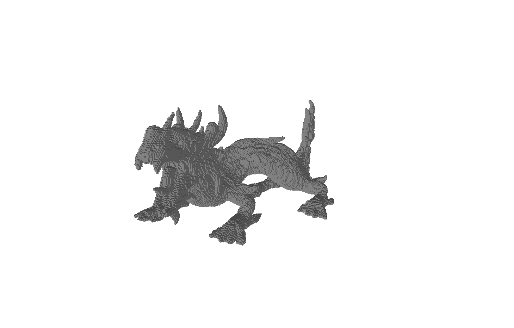
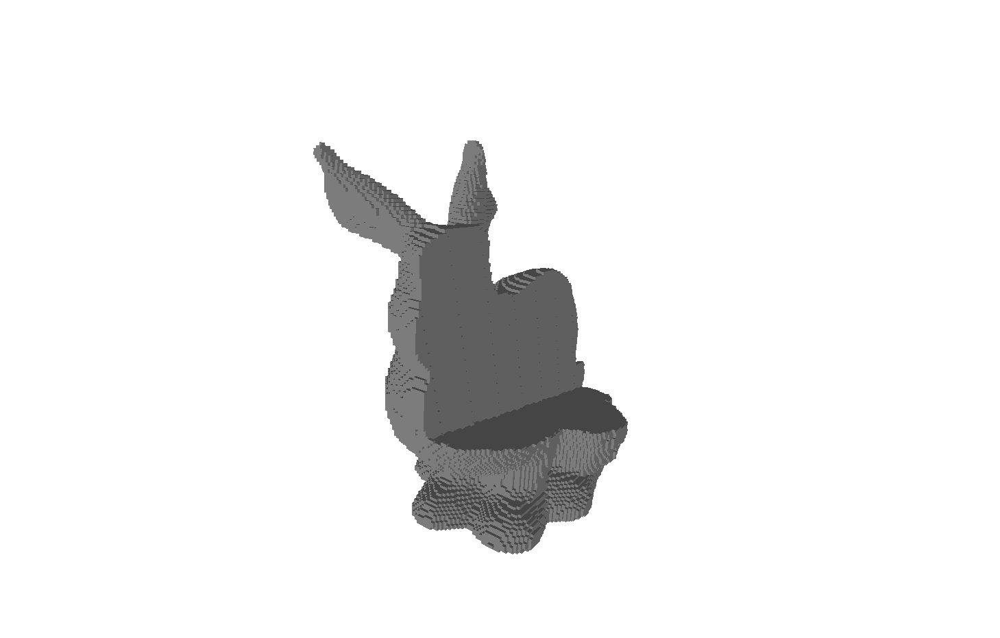
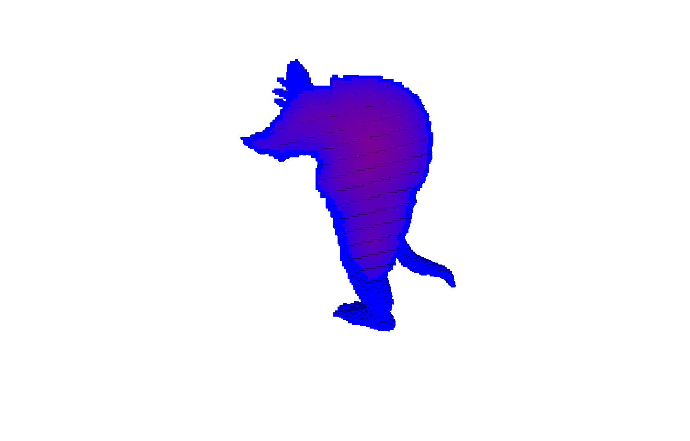

# CUDA Mesh Voxelization

## 1. Introduction

**CUDA Mesh Voxelization** is a C++/CUDA library and CLI for 3D mesh voxelization, CSG operations, and Signed Distance Field (SDF) computation on the GPU.  
The project is designed for benchmarking, visualization, and manipulation of volumetric 3D data, with a particular focus on performance and extensibility.

### Features

- **Mesh Voxelization:** Converts 3D triangle meshes into solid or surface voxel grids.
- **CSG Operations:** Supports union, intersection, and difference operations between voxelized meshes.
- **SDF Calculation:** Computes the signed distance field using the Jump Flooding Algorithm (JFA).
- **CLI Application:** Command-line interface for batch processing and benchmarking.
- **Benchmarking:** Comparative analysis between sequential, OpenMP, and CUDA implementations.
- **Visualization:** Exports voxel grids for analysis and plotting.

---

## 2. Papers, Libraries, and Requirements

### Reference Papers and Algorithms

- [Fast Parallel Surface and Solid Voxelization on GPUs by Michael Schwarz and Hans-Peter Seidel (2010)](https://michael-schwarz.com/research/publ/files/vox-siga10.pdf)
- [Out-of-Core Construction of Sparse Voxel Octrees](https://graphics.cs.kuleuven.be/publications/BLD14OCCSVO)
- [Jump Flooding in GPU with Applications to Voronoi Diagram and Distance Transform](https://www.comp.nus.edu.sg/~tants/jfa/i3d06.pdf)

### Libraries Used

- [cxxopts](https://github.com/jarro2783/cxxopts) for CLI parsing
- CMake as the build system

### Software Requirements

- **C++:** >= C++23
- **CUDA Toolkit:** >= 12.0
- **CMake:** >= 3.20
- **Compiler:** GCC/Clang/MSVC with C++23 support

---

## 3. Installation and Usage

### Installation

```bash
git clone https://github.com/<your-username>/cuda-mesh-voxelization.git
cd cuda-mesh-voxelization
git submodule update --init --recursive
cmake -S . -B build
cmake --build build --config Release
```

### Basic Usage

Voxelize a mesh and export the result:

```bash
./build/Release/apps/cli/cli assets/bunny.obj -n 128 -e -t 2 -p 1 -s
```

**Main options:**
- `-n` number of voxels per grid side
- `-e` enable export
- `-t` algorithm type (0 = sequential, 1 = naive, 2 = tiled, 3 = OpenMP)
- `-p` CSG operation type (1 = union, 2 = intersection, 3 = difference)
- `-s` compute SDF

For all available options:
```bash
./build/Release/apps/cli/cli -h
```

---

## 4. Results

<div style="text-align:center;">
  <div style="display:inline-block; text-align:center; margin:5px; width:300px;">
    <br>
    <div style="text-align:center; margin-top:8px;">
      <b>Stanford Armadillo</b> model generated with 64 voxels per side
    </div>
  </div>
  <div style="display:inline-block; text-align:center; margin:5px; width:300px;">
    <br>
    <div style="text-align:center; margin-top:8px;">
      <b>Stanford Dragon</b> model generated with 256 voxels per side
    </div>
  </div>
  <div style="display:inline-block; text-align:center; margin:5px; width:300px;">
    <br>
    <div style="text-align:center; margin-top:8px;">
      <b>Stanford Bunny</b> model (opened), generated with 128 voxels per side
    </div>
  </div>
</div>

<br>

<div style="text-align:center;">
  <div style="display:inline-block; text-align:center; margin:10px; vertical-align:top; width:400px;">
    <br>
    <div style="text-align:center; margin-top:8px;">
      Section of the Stanford Armadillo model with 128 voxels, where each voxel is colored according to its signed distance function (SDF) value.
    </div>
  </div>
  <div style="display:inline-block; text-align:center; margin:10px; vertical-align:top; width:400px;">
    <br>
    <div style="text-align:center; margin-top:8px;">
      Section of a CSG model obtained from the union of the Bimba and Stanford Bunny models. The model contains 64 voxels, each assigned a color based on its signed distance function (SDF) value.
    </div>
  </div>
</div>

---

## 5. Benchmark and Performance Analysis

### Voxelization Performance Charts

Comparison between a naive CUDA voxelization algorithm and a tiled CUDA implementation. Experiments were conducted on a machine equipped with four AMD EPYC 7301 16-Core Processors and an NVIDIA A30 GPU.

<p align="center">
  <div style="display:inline-block; text-align:center; margin:5px"> 
    <br>
        <sub>Stanford Bunny 3,510 faces</sub>
  </div>
  <div style="display:inline-block; text-align:center; margin:5px">
    <br>
        <sub>Stanford Bunny 56,172 faces</sub>
  </div>
  <div style="display:inline-block; text-align:center; margin:5px">
    <br>
        <sub>Stanford Bunny 168,516 faces</sub>
  </div>
</p>

<p align="center">
  <div style="display:inline-block; text-align:center; margin:5px">
    <br>
        <sub>Stanford Bunny 337,032 faces</sub>
  </div>
  <div style="display:inline-block; text-align:center; margin:5px">
    <br>
        <sub>Stanford Bunny 674,064 faces</sub>
  </div>
  <div style="display:inline-block; text-align:center; margin:5px">
    <br>
        <sub>Stanford Bunny 1,348,128 faces</sub>
  </div>
</p>

### JFA Performance Charts

Comparison between a naive CUDA JFA algorithm and an OpenMP CPU implementation. The algorithm is applied to a Stanford Bunny model with 168,516 faces. Experiments were conducted on a machine equipped with four AMD EPYC 7301 16-Core Processors and an NVIDIA A30 GPU.

<p align="center">
  <div style="display:inline-block; text-align:center; margin:5px">
    <br>
            <sub>Comparison chart of the different implementations.</sub>
  </div>
  <div style="display:inline-block; text-align:center; margin:5px">
    <br>
            <sub>Comparison chart of the different stages of the implementation.</sub>
  </div>
</p>

---

## 6. References

- [Fast Parallel Surface and Solid Voxelization on GPUs by Michael Schwarz and Hans-Peter Seidel (2010)](https://michael-schwarz.com/research/publ/files/vox-siga10.pdf)
- [Out-of-Core Construction of Sparse Voxel Octrees](https://graphics.cs.kuleuven.be/publications/BLD14OCCSVO)
- [Jump Flooding in GPU with Applications to Voronoi Diagram and Distance Transform](https://www.comp.nus.edu.sg/~tants/jfa/i3d06.pdf)