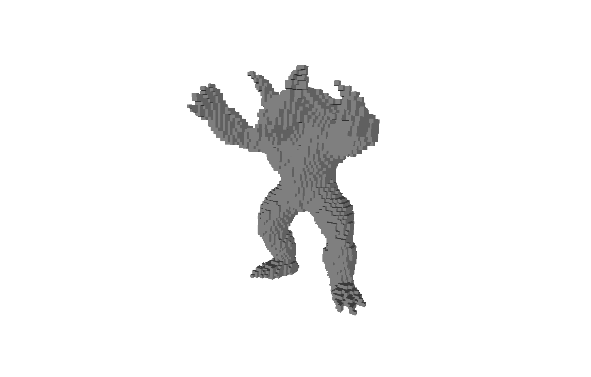
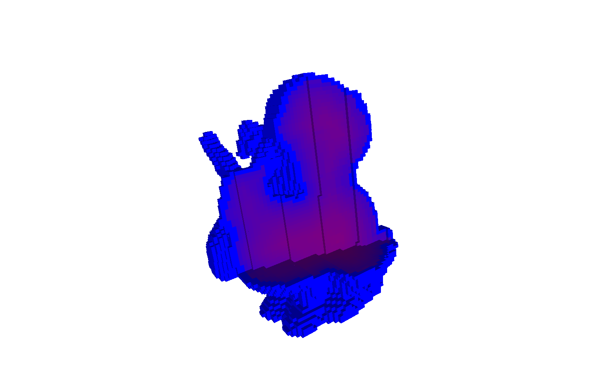

# CUDA Mesh Voxelization

## 1. Introduction

**CUDA Mesh Voxelization** is a C++/CUDA library and CLI for 3D mesh voxelization, CSG operations, and Signed Distance Field (SDF) computation on the GPU.  
The project is designed for benchmarking, visualization, and manipulation of volumetric 3D data, with a particular focus on performance and extensibility.

### Features

- **Mesh Voxelization:** Converts 3D triangle meshes into solid or surface voxel grids.
- **CSG Operations:** Supports union, intersection, and difference operations between voxelized meshes.
- **SDF Calculation:** Computes the signed distance field using the Jump Flooding Algorithm (JFA).
- **CLI Application:** Command-line interface for batch processing and benchmarking.
- **Benchmarking:** Comparative analysis between sequential, OpenMP, and CUDA implementations.
- **Visualization:** Exports voxel grids for analysis and plotting.

---

## 2. Papers, Libraries, and Requirements

### Reference Papers and Algorithms

- [Fast Parallel Surface and Solid Voxelization on GPUs by Michael Schwarz and Hans-Peter Seidel (2010)](https://michael-schwarz.com/research/publ/files/vox-siga10.pdf)
- [Out-of-Core Construction of Sparse Voxel Octrees](https://graphics.cs.kuleuven.be/publications/BLD14OCCSVO)
- [Jump Flooding in GPU with Applications to Voronoi Diagram and Distance Transform](https://www.comp.nus.edu.sg/~tants/jfa/i3d06.pdf)

### Libraries Used

- [cxxopts](https://github.com/jarro2783/cxxopts) for CLI parsing
- CMake as the build system

### Software Requirements

- **C++:** >= C++23
- **CUDA Toolkit:** >= 12.0
- **CMake:** >= 3.20
- **Compiler:** GCC/Clang/MSVC with C++23 support

---

## 3. Installation and Usage

### Installation

```bash
git clone https://github.com/<your-username>/cuda-mesh-voxelization.git
cd cuda-mesh-voxelization
git submodule update --init --recursive
cmake -S . -B build
cmake --build build --config Release
```

### Basic Usage

Voxelize a mesh and export the result:

```bash
./build/Release/apps/cli/cli assets/bunny.obj -n 128 -e -t 2 -p 1 -s
```

**Main options:**
- `-n` number of voxels per grid side
- `-e` enable export
- `-t` algorithm type (0 = sequential, 1 = naive, 2 = tiled, 3 = OpenMP)
- `-p` CSG operation type (1 = union, 2 = intersection, 3 = difference)
- `-s` compute SDF

For all available options:
```bash
./build/Release/apps/cli/cli -h
```

---

## 4. Results

<div align="center">

<table>
  <tr>
    <td width="33%"></td>
    <td width="33%"></td>
    <td width="33%"></td>
  </tr>
  <tr>
    <td width="33%">
      <b>Stanford Armadillo</b><br>64 voxels/side
    </td>
    <td width="33%">
      <b>Stanford Dragon</b><br>256 voxels/side
    </td>
    <td width="33%">
      <b>Stanford Bunny</b><br>128 voxels/side
    </td>
  </tr>
</table>

<br>

<table>
  <tr>
    <td width="48%"></td>
    <td width="48%"></td>
  </tr>
  <tr>
    <td width="48%">
      Armadillo section (128 voxels), colored by SDF value.
    </td>
    <td width="48%">
      CSG section (Bimba ∪ Bunny, 64 voxels), colored by SDF value.
    </td>
  </tr>
</table>
</div>

---

## 5. Benchmark and Performance Analysis

### Voxelization Performance Charts

<div align="center">

<table>
  <tr>
    <td align="center" width="350">
      <br>
      <sub>Bunny 3,510 faces</sub>
    </td>
    <td align="center" width="350">
      <br>
      <sub>Bunny 56,172 faces</sub>
    </td>
    <td align="center" width="350">
      <br>
      <sub>Bunny 168,516 faces</sub>
    </td>
  </tr>
  <tr>
    <td align="center" width="350">
      <br>
      <sub>Bunny 337,032 faces</sub>
    </td>
    <td align="center" width="350">
      <br>
      <sub>Bunny 674,064 faces</sub>
    </td>
    <td align="center" width="350">
      <br>
      <sub>Bunny 1,348,128 faces</sub>
    </td>
  </tr>
</table>

</div>

### JFA Performance Charts

<div align="center">

<table style="margin:0 auto;">
  <tr>
    <td align="center" width="400" style="padding:2px;">
      <br>
      <sub>Implementations comparison</sub>
    </td>
    <td align="center" width="440">
      <br>
      <sub>Stages comparison</sub>
    </td>
  </tr>
</table>

</div>

---

## 6. References

- [Fast Parallel Surface and Solid Voxelization on GPUs by Michael Schwarz and Hans-Peter Seidel (2010)](https://michael-schwarz.com/research/publ/files/vox-siga10.pdf)
- [Out-of-Core Construction of Sparse Voxel Octrees](https://graphics.cs.kuleuven.be/publications/BLD14OCCSVO)
- [Jump Flooding in GPU with Applications to Voronoi Diagram and Distance Transform](https://www.comp.nus.edu.sg/~tants/jfa/i3d06.pdf)
